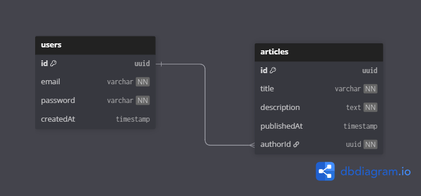

# UzInfoCom Task - NestJS API

RESTful API built with NestJS framework, PostgreSQL, Redis, and Docker.

## Prerequisites

- Node.js v20+
- PNPM
- Docker & Docker Compose

### Sql schema

## Local Development

### 1. Setup Environment
```bash
cp .env.example .env
```

### 2. Docker Compose
```bash
docker compose -f docker-compose.yml up -d
```

### 3. migration
```bash
pnpm run migration:run
```

## Production Deployment

### 1. Build Docker Image
```bash
docker build -t uzinfocom-task .
```

### 2. Run Production
```bash
docker compose -f docker-compose.prod.yml up -d
```

## API Access

- **API:** http://localhost:3000
- **Swagger:** http://localhost:3000/docs

## API Access for production
- **API:** https://article.deltateam.uz/
- **Swagger:** https://article.deltateam.uz/docs
## Environment Variables

```env
NODE_ENV=development

DATABASE_USER=postgres
DATABASE_PASSWORD=postgres
DATABASE_NAME=myapp
DATABASE_HOST=postgres
DATABASE_PORT=5432


REDIS_HOST=redis
REDIS_PORT=6379

JWT_SECRET=supersecret
JWT_EXPIRES_IN=3600s
```

if you want to use production environment, you need to set NODE_ENV=production
and set swagger credentials in .env file
```env
SWAGGER_USER=admin
SWAGGER_PASS=dh38dh32hd89233whkae
```

## Common Commands

```bash
# View logs
docker compose logs -f

# Up services
docker compose -f docker-compose.yml up -d

# Stop services
docker compose down

# Run migrations
pnpm run migration:run

# Run tests
pnpm run test
```

## Ports

- API: 3000
- PostgreSQL: 5432
- Redis: 6379